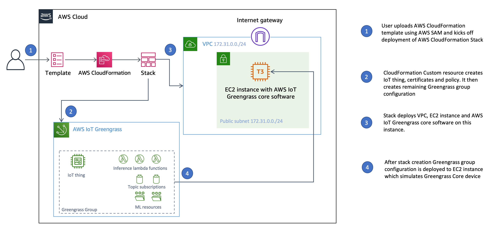
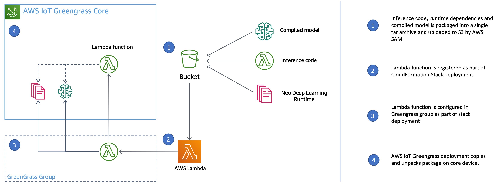
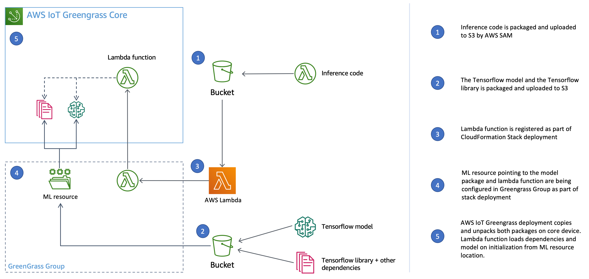
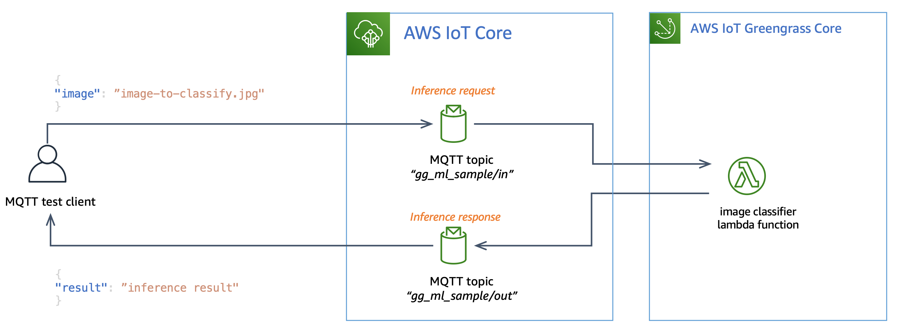
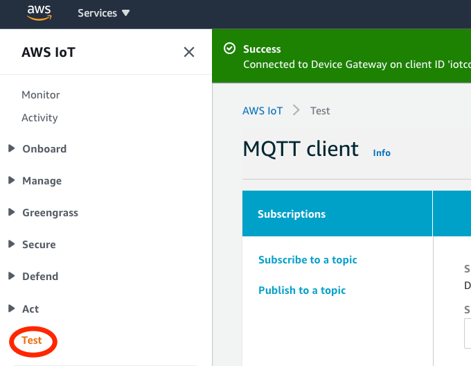

# Deployment options for machine learning inference on AWS Greengrass

## Introduction

This repository provides an overview of deployment options for machine learning inference on AWS Greengrass. It includes both an overview of available options and underlying concepts, and a practical implementation sample.

## Performing ML inference at the edge with AWS IoT Greengrass

With AWS IoT Greengrass, you can [perform machine learning (ML) inference at the edge](https://docs.aws.amazon.com/greengrass/latest/developerguide/ml-inference.html) on locally generated data using cloud-trained models. You benefit from the low latency and cost savings of running local inference, yet still take advantage of cloud computing power for training models and complex processing.

In order to perform ML inference at the edge with [AWS IoT Greengrass](https://aws.amazon.com/greengrass/) you need to deploy 3 components on the Greengrass device:

1. A trained machine learning (ML) model
2. Inference code deployed as lambda function
3. Machine learning libraries required for inference, like Tensorflow, Pytorch or the [Amazon SageMaker Neo deep learning runtime](https://docs.aws.amazon.com/greengrass/latest/developerguide/ml-inference.html#dlc-optimize-info)

Each of these components has different requirements in terms of storage and update frequency:

| Part               | Typical size      | Update demand frequency                   |
| ------------------ | ----------------- | ----------------------------------------- |
| 1. ML model        | few MB up to a GB | medium to high (depending on model decay) |
| 2. Inference logic | usually few KB    | medium                                    |
| 3. ML Libraries    | up to several Gb  | low (new versions, security fixes)        |

Depending on size and and update frequency there are several options you can pick for deployment of each component.

### Deploying the trained ML Model

The machine learning model can be included as part of the AWS Lambda function deployment package itself or deployed using a ["ML resources"](https://docs.aws.amazon.com/greengrass/latest/developerguide/ml-inference.html) in AWS Greengrass.

Using ML resources is usually the preferred way, as:

- The model is or can get too big to fit in the maximum deployment package size of a lambda function (50 MB zipped)
- The model should typically be deployable independent of the lambda function code

### Deploying the inference logic

The inference code itself can be deployed either as a AWS-provides Greengrass connector (e.g. for [image classification](https://docs.aws.amazon.com/greengrass/latest/developerguide/image-classification-connector.html) or [object detection](https://docs.aws.amazon.com/greengrass/latest/developerguide/obj-detection-connector.html)) or as part of the [AWS Lambda function](https://docs.aws.amazon.com/greengrass/latest/developerguide/lambda-functions.html).

This sample is about deplyoing the inference code in a AWS Lambda function. That AWS Lambda function uses a machine learning library to call the model for inference and returns the results as required within the business context. In a production setting the deployment of the lambda function should be automated by describing infrastructure as code. A common tool particularly when automating the deployment of AWS Lambda functions is [AWS SAM](https://github.com/awslabs/serverless-application-model).
AWS SAM makes it easy to organize all required resources in a single stack and has best-practices for deployment built-in.

### Deploying machine learning libraries

In order to get predictions from a model within your inference code you require the necessary machine learning library. This is typically a machine learning library optimized for inference at the edge like the [Amazon SageMaker Neo deep learning runtime](https://docs.aws.amazon.com/greengrass/latest/developerguide/ml-inference.html#dlc-optimize-info) or [Tensorflow Lite](https://www.tensorflow.org/lite).
These libraries are small in size and can be included as part of the lambda deployment package.

However not all model architectures are supported by these edge optimized inference libraries. For deep learning models it is not uncommon to require a full distribution of [Tensorflow](https://www.tensorflow.org/), [Pytorch](https://pytorch.org/) or [MXNet](https://mxnet.apache.org/) to be deployed on the edge device. These libraries can be several hundred MB in size, which makes them impossible to be included in the AWS Lambda deployment package.

There are two ways to deal with these large libraries during deployment:

- Deploy ML libraries on OS level on the Greengrass core
- Deploy ML libraries using a [Greengrass ML resource](https://docs.aws.amazon.com/greengrass/latest/developerguide/ml-inference.html)

#### Installing ML libraries on OS level

A typical way this is done is using the OS or language specific package manager, e.g. using the system python package manager:

```bash
pip install tensorflow
```

This comes with two big disadvantages:

- the deployment of the libraries is decoupled from the standard [Greengrass group deployment process](https://docs.aws.amazon.com/greengrass/latest/developerguide/deployments.html)
- the deployment requires a separate custom agent on the device or remote OS access to perform the installation and required updates

#### Installing ML libraries using Greegrass ML resources

Another option is to bundle required libraries and use ["ML resources"](https://docs.aws.amazon.com/greengrass/latest/developerguide/ml-inference.html) during deployment and load the libraries dynamically
on function startup. In Python this can be achieved in two ways:

- by setting the PYTHONPATH environment variable to the location of the ML resource (Containerized lambda functions only).
- or by dynamically appending the location of the libraries to the Python system path (non-containerized lambda functions):

```python
import sys
import os

resourcePath = os.getenv("AWS_GG_RESOURCE_PREFIX")
python_pkg_path = os.path.join(
    resourcePath, "<path_to_dependencies>")
sys.path.append(python_pkg_path)
```

This allows you to deploy machine earning libraries as part of the standard Greengrass deployment process and has no limitation on the maximum size of the libraries imposed by the deployment process.

#### How it works in detail

The content of the file referenced in the ML resource containing the pre-built libraries will be transferred from an Amazon S3 bucket to your Greengrass devices and unpackaged in a local directory. As the AWS Lambda ML inference function starts, AWS IoT Greengrass core will mount the local directory with unpackaged contents of the file to a local directory in the Lambda container e.g. `/mllibs`.

The Python interpreter then uses the environment variable PYTHONPATH to look for and load available libraries. If you configure PYTHONPATH in GG Group Lambda config, it‘s prepended to an actual PYTHONPATH, e.g. if PYTHONPATH=„/mllibs“ in GG group Lambda settings the PYTHONPATH is „/mllibs:/lamba“ during Lambda execution

## Implementation sample

This repository contains a sample demonstrating various options for inference deployment using AWS IoT Greengrass core. In this section, we will describe the steps which you need to perform to run the sample in your AWS account.

### Prerequisites

- AWS Account
- [AWS CLI](https://aws.amazon.com/cli/) - AWS Command Line Interface
- [AWS SAM](https://docs.aws.amazon.com/serverless-application-model/latest/developerguide/serverless-sam-cli-install.html) including Docker
- Tested on MacOS but should work on any Linux environment

### Getting started

1. Clone this repository to your local machine

```bash
git clone https://github.com/aws-samples/gg-ml-deployment-sample
```

2. in [Makefile](Makefile) edit the first two lines with a EC2 key pair name and the location of the SSK key .pem file on your file system. This key can be used to access the Amazon EC2 instance running AWS IoT Greengrass Core later.

```make
KEY_PAIR_NAME=iot-ml-sample
KEY_PAIR_FILE=~/.ssh/iot-ml-sample.pem
```

- If you don't already have a SSK key pair which you would like to use, you can find instruction on how to create a new key pair [here](https://docs.aws.amazon.com/AWSEC2/latest/UserGuide/ec2-key-pairs.html)

- ensure AWS CLI has credentials configured and the region is setup properly, then run

```bash
make deploy
```

### What is being deployed

This sample will configure and deploy an AWS IoT Greengrass Group on an Amazon EC2 instance. The AWS IoT Greengrass Group will include 3 AWS Lambda functions which each use a [MobileNetV2](https://arxiv.org/abs/1801.04381) image classification model architecture for inference.

There are 3 variants of AWS Lambda functions:

- one AWS Lambda function with a compiled SageMaker Neo model, which includes all required artifacts within the lambda deployment itself
- two AWS Lambda functions using a plain Tensorflow model for inference. The model and dependencies are imported dynamically using a ml resource. One function runs with and the other without containerization.

The deployment of the Greengrass group and core is fully automated using AWS Cloudformation and AWS SAM. Check out [this blogpost](https://aws.amazon.com/blogs/iot/automating-aws-iot-greengrass-setup-with-aws-cloudformation/) to learn more about automating your Greengrass setup using AWS Cloudformation.

Here is high level overview of the deployment process and the infrastructure which is being deployed.



The 3 AWS Lambda functions showcase 2 different use cases:

#### Edge optimized model

This function deploys a [MobileNetV2](https://arxiv.org/abs/1801.04381) image classifier which was trained using Keras and Tensorflow and then compiled using [SageMaker NEO](https://aws.amazon.com/sagemaker/neo/). To see how the model was compiled, check out this [notebook](notebooks/02-Compile-Neo-Model.ipynb). The compiled model, its dependencies and the inference code are deployed using a single AWS lambda deployment package:



#### Full Tensorflow model

Similar to the first function we are deploying a Tensorflow model here. However we will pull in the model as well as the Tensorflow library and the rest of the dependencies using an ML resource. In this example there are two flavors of this function being deployed. One function is running in containerized mode on the core device, the other without.



### Testing the example

To test the deployment is working correctly, you can send an inference request containing an image url to each of the lambda functions. You will get a classification result as response. Following image shows the inference flow in detail:



Follow these steps to try the flow for yourself:

1. Log into AWS console
2. In the services dropdown select IoT Core
3. Select Test in the left navigation

   

4. Type in `gg_ml_sample/out` as subscription topic and select `Subscribe to topic`
5. Type in `gg_ml_sample/in` as the topic and following JSON as input:

   ```json
   {
     "image": "http://farm4.static.flickr.com/3021/2787796908_3eeb73f06b.jpg"
   }
   ```

   Note the example above uses a cute dog picture as input, however feel free to paste in your own picture URL here.

6. You should see 3 results similar to this, each coming from a different AWS Lambda function:

   ```json
   {
     "image": "http://farm4.static.flickr.com/3021/2787796908_3eeb73f06b.jpg",
     "function": "arn:aws:lambda:eu-west-1:<acc-id>:function:gg-ml-sample-ImageClassifierFunctionNeo-16Q0NGPFA8KII:1",
     "result": "Tibetan terrier"
   }
   ```

### Troubleshooting tips

- if deployment of the Cloudformation stack fails, check the events for the stack in the Cloudformation console
- If deployment ran successful, but you can't see the results above, check the logs of the lambda functions. To check the logs:
  - Run `make ssh` to connect to the instance
  - Switch to root using `sudo su -``
  - you can find the logs at `/greengrass/ggc/var/log/user/<region>/<account_id>/<functionname-function-id>.log`

### What's next

Here are some ideas to inspire your further learning activities:

1. Dive deeper into coding of inference by reviewing the source code:

- [Edge optimized model](lambda/image_classifier_neo)
- [Full Tensorflow model - containerized ](lambda/image_classifier_container)
- [Full Tensorflow model - non containerized](lambda/image_classifier_no_container)

2. Review the AWS SAM [template](template.yaml)

3. To update and redeploy ML models, please review this [Jupyter notebook](notebooks/02-Compile-Neo-Model.ipynb). You can use [Amazon Sage Maker notebook instances](https://docs.aws.amazon.com/sagemaker/latest/dg/nbi.html) to load and execute commands in this notebook.
